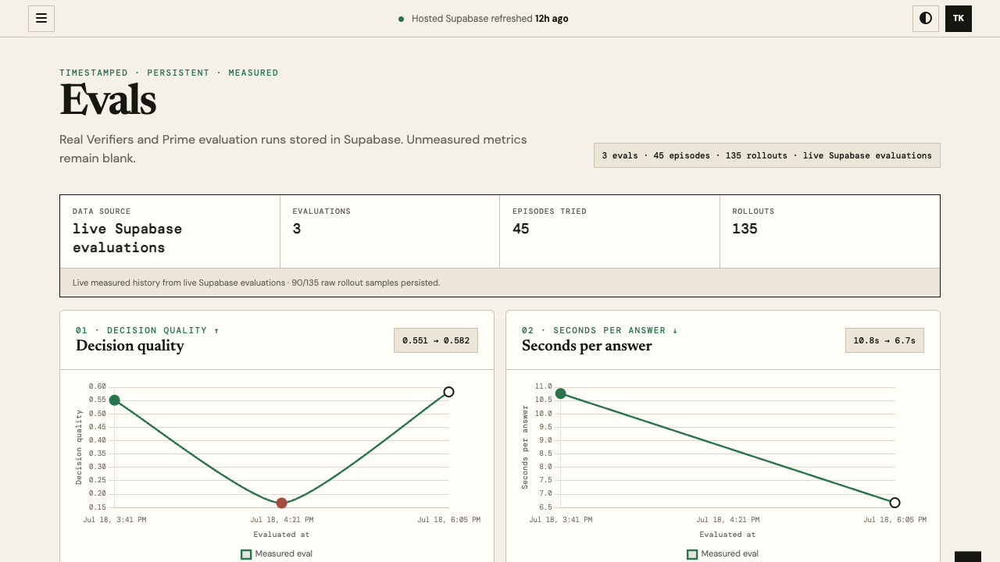
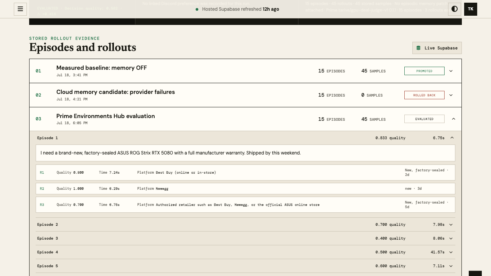
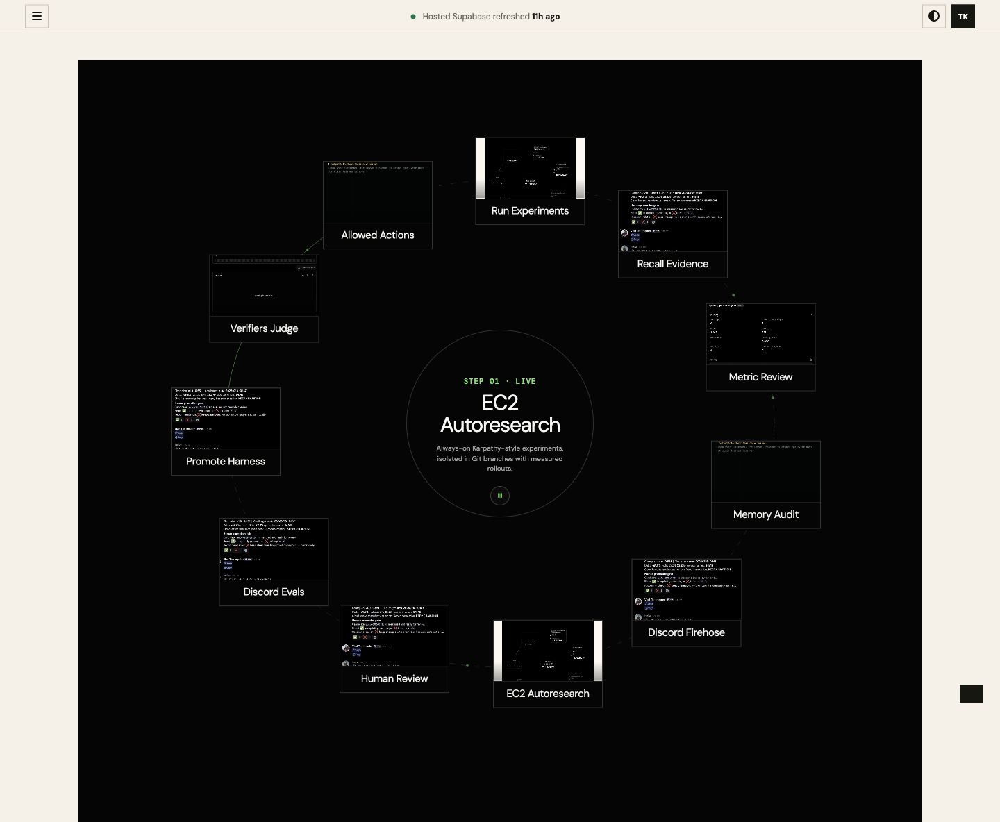

# autoresearch


*One day, frontier AI research used to be done by meat computers in between eating, sleeping, having other fun, and synchronizing once in a while using sound wave interconnect in the ritual of "group meeting". That era is long gone. Research is now entirely the domain of autonomous swarms of AI agents running across compute cluster megastructures in the skies... This repo is the story of how it all began. —@karpathy, March 2026*

**AITX SAT 2026 edition.** Same loop as [karpathy/autoresearch](https://github.com/karpathy/autoresearch): an agent edits one file, runs a fixed evaluation, **keeps** the change if the metric Pareto-improves, otherwise **discards** via git. Here the artifact under optimization is a GPU-purchase **policy** (lessons text), scored on a frozen golden set — not `val_bpb` on a GPT.

```
decision quality ↑ · seconds/answer ↓ · prompt-injection risk ↓
episodic-memory diff lines · agent-knowledge regression ↓
```

---

## How it works

The research surface is deliberately tiny — the same three files that matter in Karpathy's repo:

| File | Role | Who edits |
|------|------|-----------|
| **`prepare.py`** | Fixed constants, golden dataset, evaluation harness | Nobody (read-only) |
| **`train.py`** | Policy lessons + knobs; one experiment run | **Agent** |
| **`program.md`** | Keep/discard loop instructions | Human |

```bash
# 1. sanity-check the harness
python prepare.py --smoke

# 2. run one experiment (writes results.tsv, prints grep-friendly metrics)
python train.py --describe "baseline" --write-policy

# 3. hand the agent program.md and let it loop overnight
```

Each `train.py` run prints:

```
---
accuracy:          0.593300
retrieval_s:       2.840000
deal_safety:       100.000
...
status:            keep
```

The agent commits on **keep**, `git reset --hard HEAD~1` on **discard**. See `program.md` for the full forever-loop.

### Repo structure

```
frontend/         — Vercel Decision Frontier UI (static dashboard + demos + media)
backend/          — api/ (Vercel serverless), scripts/ (dashboard + marketplace APIs),
                    supabase/ (migrations), supabase-readonly-proxy/, infra/ (terraform EC2 hosts)
nemoclaw/         — deploy/ (nemoclaw docker-compose), config/ + identity/ (agent team),
                    scripts/ (Railway coordinator, Discord bots, sandbox wiring),
                    skills/ (hermes-tavily-search, sage-cron-publisher, supabase-readonly)
autoresearch/     — the Karpathy loop + RSI machinery (below)
docs/             — architecture notes, design QA + screenshots
```

The Karpathy-aligned core, in `autoresearch/`:

```
autoresearch/prepare.py       — constants + golden eval (do not modify)
autoresearch/train.py         — policy lessons + experiment runner (agent modifies)
autoresearch/program.md       — agent instructions
autoresearch/results.tsv      — commit / accuracy / retrieval / safety / status / description
autoresearch/progress.png     — running-best teaser
autoresearch/analysis.ipynb   — plot results.tsv
autoresearch/pyproject.toml   — dependencies
```

Supporting AITX platform (hosts, dashboards, Discord) is the compute/data plane the loop publishes into:

```
autoresearch/scripts/auto_research_loop.py   — continuous host wrapper (EC2)
nemoclaw/scripts/nemotron_coordinator.py     — Railway coordinator API
frontend/ + backend/api/                     — Vercel Decision Frontier UI
autoresearch/skill/                          — Hermes #4823 helpers (state/plan/git workspace)
autoresearch/environments/gpu_deal_judge*/   — Prime / Verifiers tasksets
backend/infra/terraform/                     — EC2 agent host
```

---

## Quick start

**Requirements:** Python 3.10+, NVIDIA or OpenRouter inference key for live evals.

```bash
git clone https://github.com/Tar-ive/AITX-SAT-2026.git
cd AITX-SAT-2026

python -m venv .venv && source .venv/bin/activate
pip install -r requirements.txt
# or: uv sync

cp .env.example .env   # set NVIDIA_INFERENCE_API_KEY (and optional OPENROUTER_API_KEY)

python prepare.py --smoke
python train.py --describe "baseline" --write-policy
```

Point Claude / Codex / Hermes at `program.md` and kick off:

```
Hi have a look at program.md and let's kick off a new experiment! let's do the setup first.
```

---

## Design choices

- **Single file to modify.** The agent only touches `train.py`. Diffs stay reviewable.
- **Fixed evaluation.** `prepare.evaluate` is the ground truth (golden set × rollouts). No silent rubric drift.
- **Pareto keep gate.** Accuracy must rise; deal safety must not fall; retrieval may not blow up past 1.3× champion — same spirit as Karpathy's "lower val_bpb or discard."
- **Online-first product constraint.** Micro Center member/in-store prices may be mentioned as local pickup, never as the sole "best place to buy."
- **Self-contained core.** `prepare.py` + `train.py` + `program.md` need only `requests` + the golden JSON.

---

## The live recursive-improvement loop

The UI presents one continuous 11-step loop. Hover a card to read the operating
detail; open or fullscreen its recording to inspect the underlying evidence.

1. **EC2 Autoresearch** — an always-on Karpathy-style loop runs each rollout in
   an isolated Git branch.
2. **Discord Firehose** — `#daily` supplies agent prices, thread replies,
   reactions, and user preferences.
3. **Memory Audit** — the orchestrator versions Hermes `SOUL.md` in Supabase
   and reads its exact diff before changing the harness.
4. **Metric Review** — it reads the current champion and the five live metrics.
5. **Recall Evidence** — Supabase supplies prior experiments, successful
   lessons, and user feedback.
6. **Run Experiments** — bounded challengers try memory synthesis, distillation,
   retrieval changes, or harness-component swaps.
7. **Allowed Actions** — OpenShell policy and past safe actions constrain access.
   HiddenLayer simulation is an allowed research route when its credentials are
   configured.
8. **Verifiers Judge** — Verifiers plus an LLM judge score the same frozen GPU,
   RAM, and MacBook golden dataset.
9. **Promote Harness** — only improvements across the five metrics are promoted;
   the previous champion remains available for quick rollback.
10. **Discord Evals** — every evaluation/promotion opens a titled post in the
    `#eval` forum; replies remain attached to that evaluation.
11. **Human Review** — a weekly agent synthesis asks for approval or corrections,
    which become the next cycle's evidence.

The five Evals metrics are:

1. **Decision quality**
2. **Seconds per answer**
3. **Prompt injection risk**
4. **Hermes episodic memory diff lines**
5. **Agent knowledge regression**

Prompt-injection risk is intentionally shown as **not measured** until a
dedicated injection suite runs. It is not inferred from platform-policy errors.







[Watch the recorded UI walkthrough](frontend/media/rsi-loop-live.mp4)

### How evidence reaches a research point

1. Discord exchanges are normalized into `public.episodes`; Hermes preference
   changes are versioned in `public.agent_soul`.
2. The loop writes timestamped summaries to `public.harness_experiments` and
   raw rollout payloads to `public.evaluation_samples`; the Evals API reads only
   this Supabase history.
3. Charts connect every measured evaluation by timestamp. Point color marks
   promoted, evaluated, or rolled-back runs; blank metrics stay blank.
4. Expand an evaluation, then an episode, to inspect its stored prompt and each
   rollout's score, latency, platform, condition, and lead time.
5. A kept experiment advances the champion; a discarded branch is retained in
   the chart as negative evidence.

---

## Data plane: EC2 → Railway → Vercel

```
 ┌─────────────────────────────┐
 │  EC2 agent host (Terraform) │
 │  backend/infra/terraform    │
 │                             │
 │  docker compose stack       │
 │  • Discord agents / Hermes  │
 │  • autoresearch/scripts/    │
 │    auto_research_           │
 │    loop.py  OR  train.py    │
 │  • nightly RSI / episodes   │
 └──────────────┬──────────────┘
                │ POST /api/radar
                │ POST /api/evaluations
                │ POST /api/episodic-memory
                │ SQL → episodes / agent_soul / harness_experiments
                ▼
 ┌─────────────────────────────┐
 │  Railway                    │
 │  Procfile → nemotron_       │
 │  coordinator.py             │
 │                             │
 │  Live JSON:                 │
 │  • /api/radar               │
 │  • /api/evaluations         │
 │  • /api/autoresearch/*      │
 └──────────────┬──────────────┘
                │ HTTPS fetch
                ▼
 ┌─────────────────────────────┐     ┌──────────────────────┐
 │  Vercel                     │────▶│  Supabase (hosted)   │
 │  vercel.json                │     │  marketplace rows    │
 │  • frontend/*  (static)     │     │  rsi_runs / episodes │
 │  • backend/api/index.py     │     │  search_cache        │
 │    (serverless)             │     │  harness_experiments │
 │                             │     │  agent_soul          │
 │    /api/marketplace         │     └──────────────────────┘
 │    /api/improvement         │
 │    /api/autoresearch-       │
 │         experiments         │
 └─────────────────────────────┘
```

### What each hop does

1. **EC2 (always-on)** — Terraform provisions the host
   (`backend/infra/terraform`). `nemoclaw/deploy/docker-compose` runs the agent
   sandbox. Autoresearch either:
   - runs the Karpathy loop by hand (`train.py` + git keep/discard), or
   - runs `autoresearch/scripts/auto_research_loop.py` on a timer
     (`CYCLE_SECS=300`), recalls Supabase evidence, mutates lessons, evaluates,
     writes `harness_experiments`, and posts each cycle to Railway.
   The host also serves `/leaderboard` + `/radar` through
   `backend/scripts/search_cache_service.py`. Nightly RSI writes episodes and
   measured runs to Supabase.

   Sync the preference memory manually when testing:

   ```bash
   python autoresearch/scripts/soul_sync.py push --agent hermes --file SOUL.md
   python autoresearch/scripts/soul_sync.py diff-lines --agent hermes
   ```

2. **Railway (coordinator)** — `Procfile` / `railway.toml` start
   `nemoclaw/scripts/nemotron_coordinator.py`. It stores radar snapshots and
   evaluations on the service and exposes:
   - `GET/POST /api/radar` — experiment history for live charts
   - `GET/POST /api/evaluations`
   - `GET /api/autoresearch/status`, `POST /api/autoresearch/control` (pause/stop)
   - `GET /autoresearch` — lightweight Karpathy staircase page

3. **Vercel (Decision Frontier)** — `vercel.json` serves `frontend/` as static
   files and routes `/api/*` to `backend/api/index.py`, which calls
   `backend/scripts/dashboard_api.py`. The Evals page:
   - loads `/api/autoresearch-experiments` exclusively from timestamped
     `harness_experiments` and `evaluation_samples` rows in Supabase
   - groups raw samples into expandable evaluations, episodes, and rollouts
   - exposes `/api/research-evidence` for the underlying user-feedback records
   - loads marketplace cards from hosted Supabase
   - plays the 11 methodology recordings from `frontend/media/`

### Environment variables (by hop)

| Hop | Key vars |
|-----|----------|
| EC2 loop | `NVIDIA_INFERENCE_API_KEY`, `OPENROUTER_API_KEY`, `OPENCODE_API_KEY`, `COORDINATOR_URL`, `CYCLE_SECS`, `SUPABASE_DB_PW` |
| Railway | `PORT`, optional `COORDINATOR_TOKEN` |
| Vercel | `SUPABASE_DB_PW`, `SUPABASE_POOLER_URL` / project ref (marketplace + RSI reads) |

Local dashboard without Vercel:

```bash
python backend/scripts/dashboard_api.py   # http://127.0.0.1:8787
open frontend/index.html#evals
```

---

## Metrics & evaluation storage

Measured evaluation runs persisted in Supabase:

| Evaluation | Episodes / rollouts | Decision quality | Median answer time |
|------------|---------------------|------------------|--------------------|
| Verifiers baseline `bed4add5` | 15 / 45 | 0.5511 | 10.76s |
| Cloud memory candidate | 15 / 45 attempted | 0.1667 | not measured |
| Prime `ipjzblojwpcswqvk67l7fczc` | 15 / 45 | 0.5822 | 6.68s |

Supabase currently contains 90 raw rollout samples. The cloud candidate has no
raw samples because 34 of its 45 provider calls failed.

The seed successfully cold-started the dashboard and has now been removed.
Real ML and RSI evaluation history in Supabase has taken over.

---

## Platform notes

- **Inference:** NVIDIA Integrate API with OpenRouter fallback (same model id).
- **Prime / Verifiers:** `autoresearch/environments/gpu_deal_judge_v1` for
  held-out PC-purchase decisions.
- **Terraform apply** may be unavailable from ephemeral Cloud Agent environments (SSO / local state); the loop itself runs anywhere with API keys — laptop, Railway sidecar, or an already-provisioned EC2 host.
- Credentials stay in `.env` (gitignored). See `docs/agent-credentials.md`.

---

## License

TBD · Autoresearch loop pattern inspired by Andrej Karpathy's autoresearch (March 2026).
