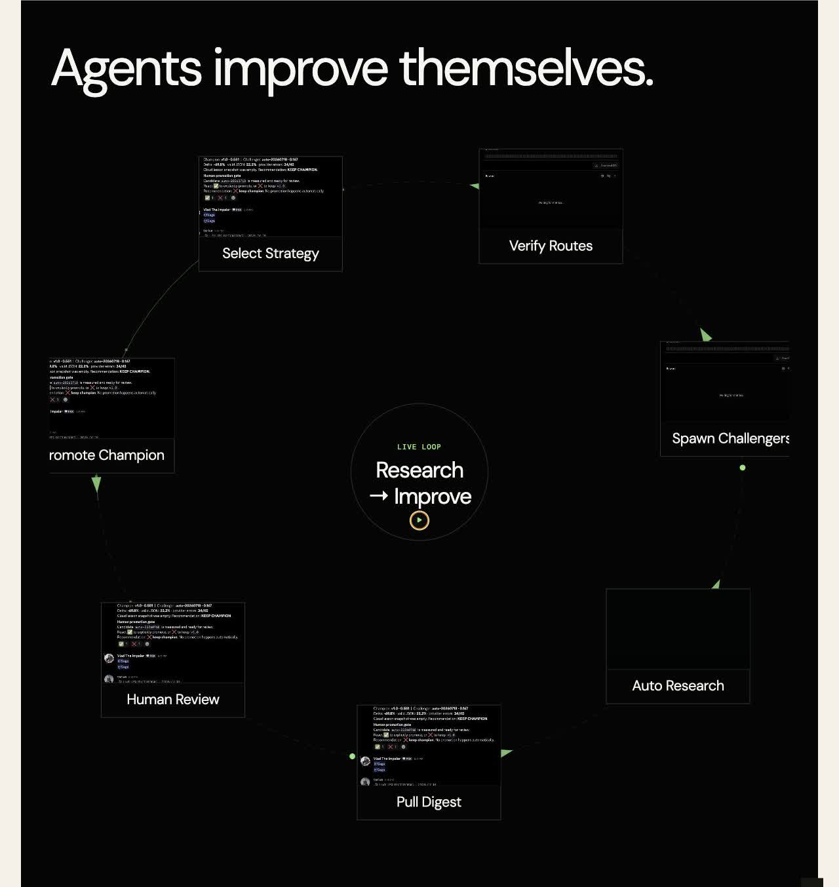
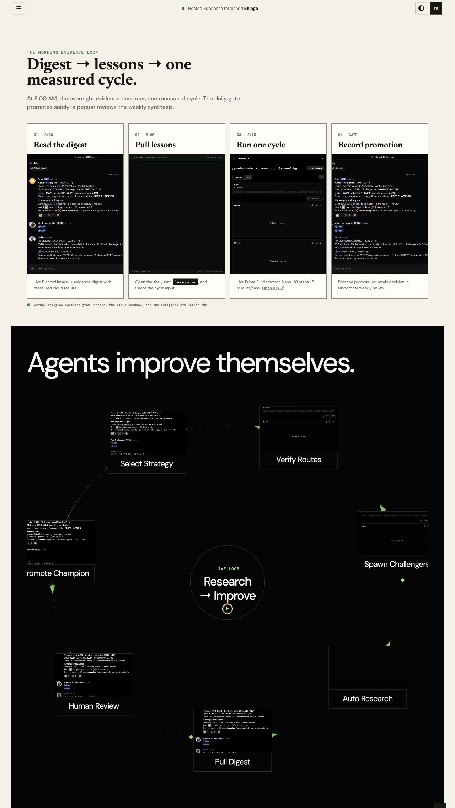
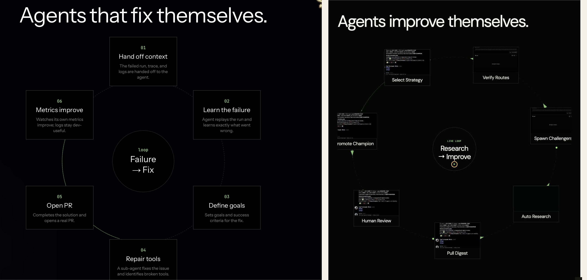

# Design QA — Methodology RSI loop

- Route: `http://127.0.0.1:8787/#methodology`
- Viewports: 1280px desktop; 390 × 844 mobile
- State: loop paused for comparison

### Screenshots

Implementation:

Full view:

Side-by-side comparison:

## Full-view comparison

The implementation matches the reference’s black canvas, oversized white heading,
thin circular track, green accent, centered loop label, and evenly distributed cards.
Seven cards are intentional because the product flow includes Auto Research. The
reference’s text-only cards are intentionally replaced by the requested real videos.

## Fidelity surfaces

- Typography: DM Sans closely matches the reference’s neutral grotesk. The heading is
  light, tightly tracked, and remains on one desktop line. Every card title is exactly
  two words.
- Spacing: the circle, center label, and cards have clear separation on desktop.
  Mobile has no card overlap, center overlap, clipping, or page-level horizontal
  overflow.
- Colors: near-black background, white type, charcoal borders, and restrained green
  accents match the source palette.
- Image quality: all seven cards use real local MP4 recordings with matching posters;
  no placeholder artwork remains.
- Copy: visible card content is limited to the video and two-word heading as requested.

## Interaction checks

- Pause and resume loop: passed.
- Zoom a card video and close the dialog: passed.
- Console errors: none.

## Comparison history

1. P2: the first mobile pass crowded cards into the center. Reduced mobile card and
   center sizes and adjusted the Three.js orbit scale. Post-fix evidence showed zero
   overlaps and zero clipping.
2. P2: the first desktop heading wrapped unlike the reference. Shortened it to
   “Agents improve themselves.” Post-fix comparison shows one-line display text.

## Focused-region evidence

No separate crop was needed: the 1594px-high side-by-side comparison keeps the heading,
center label, video imagery, card borders, and two-word titles legible.

## Findings

No actionable P0, P1, or P2 differences remain. The seven-card count and video content
are intentional product requirements rather than design drift.

**final result: passed**
